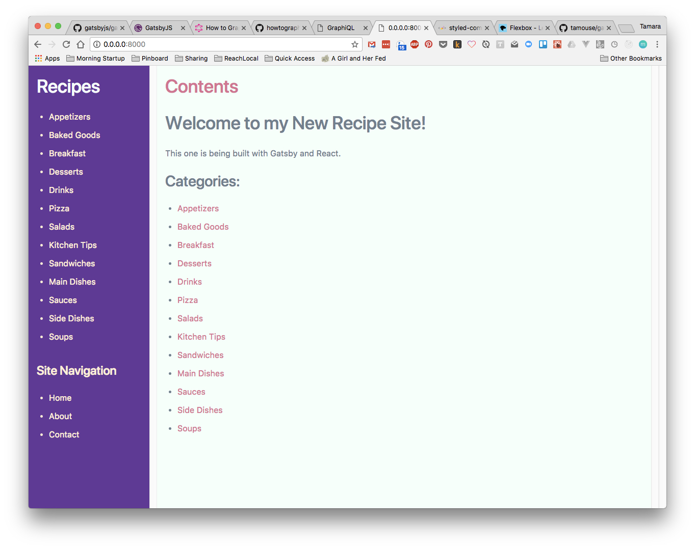
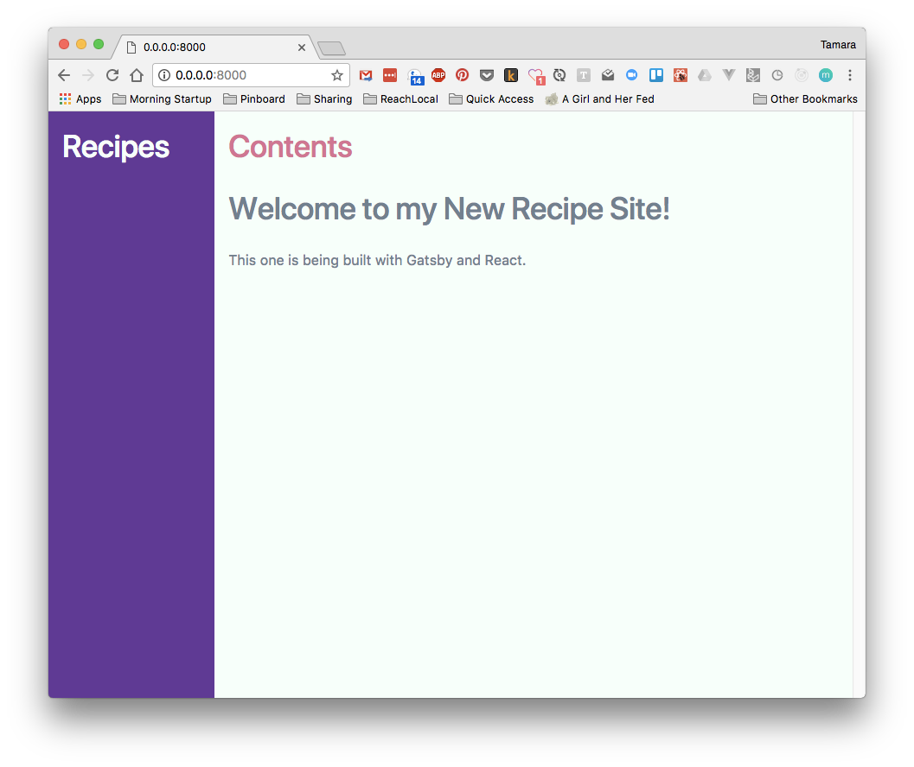

# recipes.tamouse.org site, built in Gatsby

My personal recipes website.

Way back when, I had a paper notebook that I used to write all my
recipes down in. At one point I thought for sure I had lost it, but
**no!** my lovely sister found it while we were pawing through boxes
in my storage lockers.

Nevertheless, I had started this file several years ago on old wiki,
and brought them over here in Jekyll and Bootstrap to update them and
add to them.

Now, I'm learning a new static file generator,
[Gatsby](https://www.gatsbyjs.org/) and this recipe file box seems
like a very appropriate thing to learn with.

## Development

This site was created based upon the starter kit at
<https://github.com/tamouse/gatsby-starter-hello-world>
which is forked from
<https://github.com/NogsMPLS/gatsby-starter-hello-world>
which in turn was forked from the orginal
<https://github.com/gatsbyjs/gatsby-starter-hello-world>.

### Running the site

    gatsby develop

### Building the site

    gatsby build

### Deploying the site

*T.B.D.*

I haven't yet figured out how or where I will deploy this site. I
currently have most everything hosted on a Digital Ocean droplet, but
using something like `surge.sh` has some appeal as well.

## Plugins, etc

Beyond the very basic Gatsby stuff in the `hello-world` starter kit,
the following packages have been added:

* [gatsby-image](https://github.com/gatsbyjs/gatsby/tree/master/packages/gatsby-image)
* [gatsby-plugin-sharp](https://www.gatsbyjs.org/packages/gatsby-plugin-sharp/)
* [gatsby-plugin-styled-components](https://github.com/gatsbyjs/gatsby/tree/master/packages/gatsby-plugin-styled-components)
* [gatsby-plugin-typography](https://github.com/gatsbyjs/gatsby/tree/master/packages/gatsby-plugin-typography)
* [gatsby-source-filesystem](https://github.com/gatsbyjs/gatsby/tree/master/packages/gatsby-source-filesystem)
* [gatsby-transformer-remark](https://github.com/gatsbyjs/gatsby/tree/master/packages/gatsby-transformer-remark)
* [gatsby-transformer-sharp](https://github.com/gatsbyjs/gatsby/tree/master/packages/gatsby-transformer-sharp)
* [styled-components](https://github.com/styled-components/styled-components)
* [typography-theme-bootstrap](https://github.com/KyleAMathews/typography.js/tree/master/packages/typography-theme-bootstrap)


## Learning Log

### 2017-12-02 15:44

Going deeper, learning how to do things with non-js pages, such as Markdown files.

- `gatsby-node.js` -- implementing a slug for markdown, using the examples in the tutorial docs about
  ["Programmatically creating pages from data"](https://www.gatsbyjs.org/tutorial/part-four/#programmatically-creating-pages-from-data)
  by adding some functionality to the `onCreateNode` API.

- the front page is showing Markdown files, just to show something

- some recipe files moved over from the original recipe jekyll site, and a little conversion to make them suitable for gatsby
  - date format a little squishy
  - removed liquid stuff and internal links (need to redo the latter)
  - changed the name to remove the date stamp on the front of the file name


### 2017-11-29 00:37

Using the `gatsby-source-filesystem` plugin, figured out how to filter to just grabbing the recipe categories
under `src/pages/recipes/` by using the `allFile(filter: ... )` query.

I was trying to set it up in a component, but the examples use fragments, and I'm not quite up on those.
Instead I'm repeating the query for the layout sidebar and the home page.

Documentation on this is really non-existent for Gatsby, the author, Kyle Matthews directed me to a search on fragment
in the repo: <https://github.com/gatsbyjs/gatsby/search?utf8=%E2%9C%93&q=fragment&type=>. This doesn't quite provide
me with enough information yet, but eventually.

#### 02:32

After hacking around, I arrived at a very workable solution. The fragment is built upon the Root query, so I can
use the filter option in the allFile fragment in `src/components/recipe_fragment.js`. Pretty cool. The component is being
used for both the front page and the sidebar nav.



### 2017-11-21 07:27

Figuring out how to make a full-height, side-by-side layout (typical
dashboard style) using react took a bit of poking and
prodding. Essentially, all the divs down to the flex horizontal part
need to be set at `height: 100%`. The simplest way I got there was
to create an `index.css` file next to the `src/layouts/index.js`
file with the following content:

```css
html, body, #___gatsby, #___gatsby > div {
  height: 100%;
  margin: 0;
  padding: 0;
}
```

And the `Page` container harbouring the left and right parts of the
dashboard was also set to `height: 100%`.


